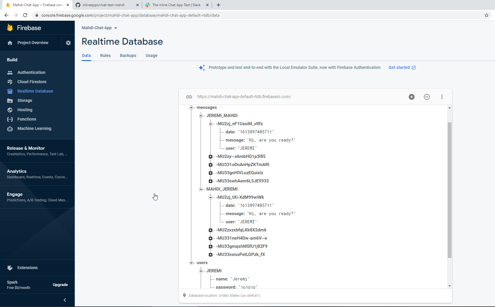
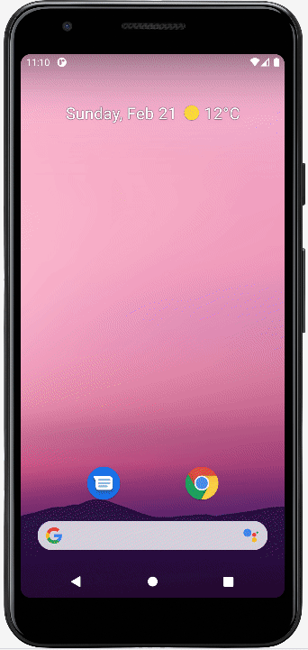

# chat-test-mahdi

# The Chat App challenge of inline 

I’d like to ask you to solve a challenge. This is a small test that every technical candidate with inline goes through.  
_The Challenge_  
Create a simple chat app, and chat with me through your app.  
_The Constraints_

* The chat messages must be delivered in realtime
* The chat media is up to you (_we suggest text, but audio or video or finger-drawings or emojis or haptic “morse code taps” etc are fine_)
* The client can be created in any environment you’d like to use (web, native, hybrid, or anything else _except Windows_)
* The chat service can be created in any platform and language you’d like to use (_we suggest using Firebase, for speed of development_)
* You may use any open source or closed source libraries, hosted services, or sample code (_technical originality is not important to us_)
* The functional scope and UI details are up to you, but please be aware that UX is an important aspect we will be judging
* The chat client(s) must connect to a service that is live, so that we can actually chat

_The Delivery_

* Estimate the number of hours you expect to spend on this _before_ you begin to write code
* Write your code in a new branch of the private GitHub repo you’ve been added to
* When you’re ready, submit a pull request that includes how long you actually spent vs your estimate and a URL to access the live chat client
* Notify me of your PR by sending me a message/email or assigning me as a reviewer
* Then I’ll review your code and we’ll chat through your app!

This shouldn’t take more than a day, but it will probably take more than one hour. This is, in truth, a quite trivial technical challenge (_ie there are many readily available solutions to choose from that can deliver a solution in less than one hour of total work_). But there are dimensions to the decisions you make in the test that are quite valuable for the purposes of generating signals that can let inline understand how you think, and what skills and knowledge you possess.

